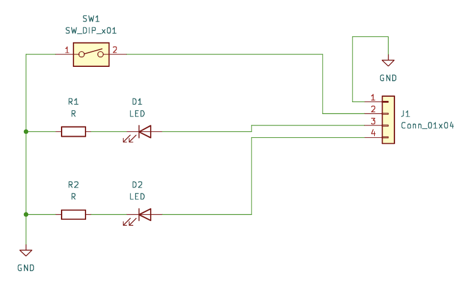

# Modules

Dies ist eine Bibliothek aller Module welche im Flugsimulator benutzt werden.

## Geplane Module

- Korry Button 389 -> (button, on_off_led, fault_led)
- Small Korry Button -> (button, on_off_led, illumination?)
- Push and Pull Knob-> (switch, impulse_a, impulse_b)
- Knob -> (reserved -> impulse_a, impulse_b)
- Stage-knob -> (tbd) -> Mobi flight implementation?
- bistable_switch -> (position_a, position_b, nc)
- tristable_switch -> (postiton_a, postition_b, position_c)

## Korry 389 Nachstellung

Dies ist die mit abstand am meisten benutzte Taster-Art im Flugsimulator.

### Werkzeuge

- Lötwerkzeug
- 3D Drucker
- Schraubendreher
- Lasercutter

### Teileliste

| Teil | Details |
|------|-------------|
| Gehäuse | 3D drucken -> housing.3mf |
| Knopf | 3D drucken -> button.3mf |
| Schrauben | 1.2x5 holzschrauben |
| Federn | 2x10 federn |
| Platine | Bestellen -> button-pcb/gbr |
| LEDs | 3mm leds |
| LED Standoffs | 4mm |
| Widerstände | |
| Pins | jst 1.5 pitch mit 4 pins |
| Knopf | 5mm button |
| Linse | Graviertes 1mm Plexiglas |

### Schema

### Herstellung

#### Linse

Der Taster ist mit einem Fenster ausgestattet welches 2 seperat beleuchtbare texte enthält. Diese Fenster werden wegen der mehrsprachigkeit "Linsen" genannt.

1. Beschichten -> das 1mm Plxiglas mit Schwarzer Sprühfarbe beschichten. Wenn nötig wiederholt beschichten, bis kein licht mehr durchdringt.
3. Schnittdaten vorbereiten -> aus dem lenses ordner die Zeichnun mit den gewünschten bezeichnungen für den Lasercutter laden
2. Gravieren -> mit dem Lasercutter die Farbschicht wegbrennen, und linse ausschneiden. Für die Gravur nicht zu tief, damit nicht zu viel plexiglas wegbrennt.

#### Platine

Um die Aktoren möglichst modular zu halten, benötigt jeder Taster eine kleine Platine. Diese Platine kann dan mit einem JST Kabel an einen controller angeschlossen werden.

1. Widerstände auflöten -> nur eine seite zuerst verzinnen, danach den widerstand mit pinzette zuführen.
2. Rest nach bauplan auflöten

#### Zusammenbau

Alle teile zusammensetzen.

## Controller

Dies ist ein Kontrollmodul, an welches die Pereferie Module angeschlossen werden können. Dieses Modul ist einfach ein Arduino mit Mobiflight software. Jedoch sitzt dieser Arduino auf einer Platine welche anschlüsse für die Pereferien anbietet.

Bei der Jetzigen version der Platine sind analog und digital Pins noch nicht auf Mobigliht abgestimmt, und GND wurde nicht verbunden.