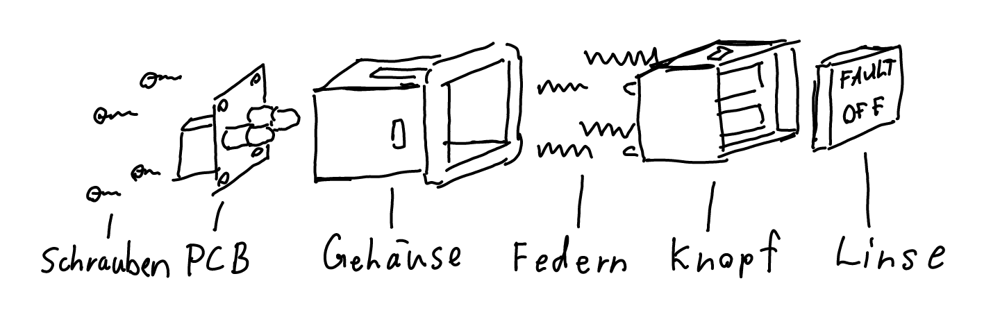
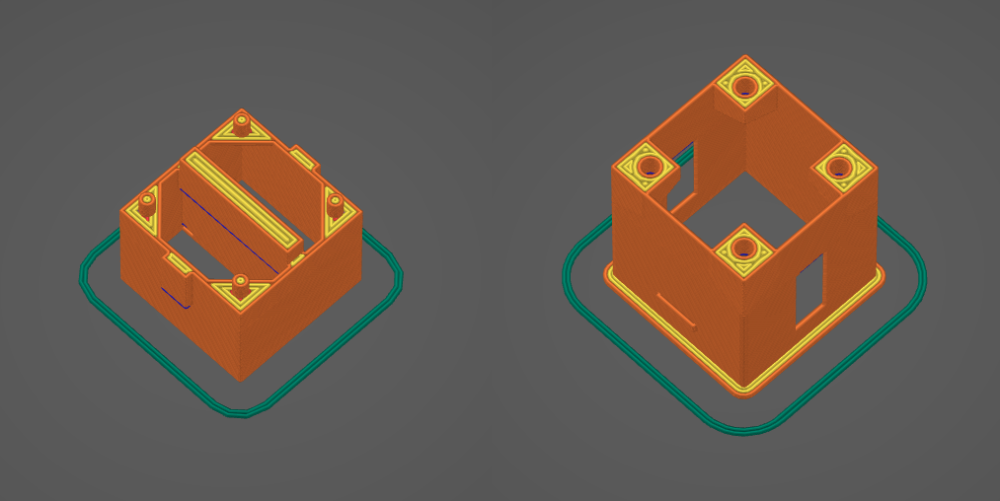

# Korry 389 Replika

## PCB

Die Platine kann bei einem PCB-Hersteller bestellt werden. Wie zum beispiel [PCBWay](pcbway.coim). Die Gerber-Dateien für die Herstellung sind unter [pcb/korry-389-gerber.zip](pcb/korry-389-gerber.zip) abgelegt.

| Stück | Beschreibung                         | Bezeichung |
| ----- | ------------------------------------ | ---------- |
| 2     | SMD Widerstand 1206 430 Ohm          | R1, R2     |
| 2     | LED Abstandshalter 3mm LEDs 5mm Höhe | D1, D2     |
| 2     | LED 3mm Durchmesser                  | D1, D2     |
| 1     | Mikro Tastschalter 6x6x6mm 2Polig    | SW1        |
| 1     | JST ZH 1.5mm 4P Gerade Pins          | J1         |

Die Bauteile können nach dem Schema platziert werden. Auf der Platine sind alle Bauteile mit ihrer Bezeichnung angeschrieben, welche in der Teileliste auch vorhanden ist.

## Federn & Schrauben

- 4x Federn 2mm x 10mm

- 4x Schrauben 1.4x6mm 

## Gehäuse und Knopf

Das Gehäuse und der Knopf werden 3D gedruckt. Das Ghäuse wird Grau gedruckt und der Knopf Schwarz. Die 3D Drucker Düse muss einen 0.4mm Durchmesser haben. Als Layerhöhe 2 verschiedene höhen nutzen für die beiden Teile, somit reiben sie nicht so stark aneinander. Der Knopf-Teil hat ausbrechbare supports.

Die 3D modelle sind unter [3d-print/button.3mf](3d-print/button.3mf) und [3d-print/housing.3mf](3d-print/button.3mf) abgelegt.

## Linse

- 2mm Opal Weiss Plexiglas

Das Plexiglas mit schwarzer Sprühfarbe beschichten. Wenn nötig wiederholt beschichten bis kein licht mehr durchdringt.

Im Ordner [lenses](lenses) sind alle vorbereitete Linsen abgelegt. Diese können mit dem Lasercutter aus dem Plexiglas graviert und geschnitten werden.

Um eigene Linsen vorzubereiten wird QCAD oder LibreCAD benötigt. Zusätzlich muss die Schriftart FreeSans auf dem Computer installiert sein. Die Vorlagendatei unter [lenses/lens-template.dxf](lenses/lens-template.dxf) kann kopiert und umbenannt werden. Dann die Beschriftungen anpassen und mit der Explodieren Funktion die Schrift in Pfade umwandeln.

